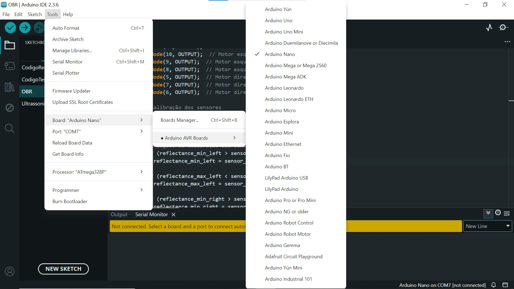
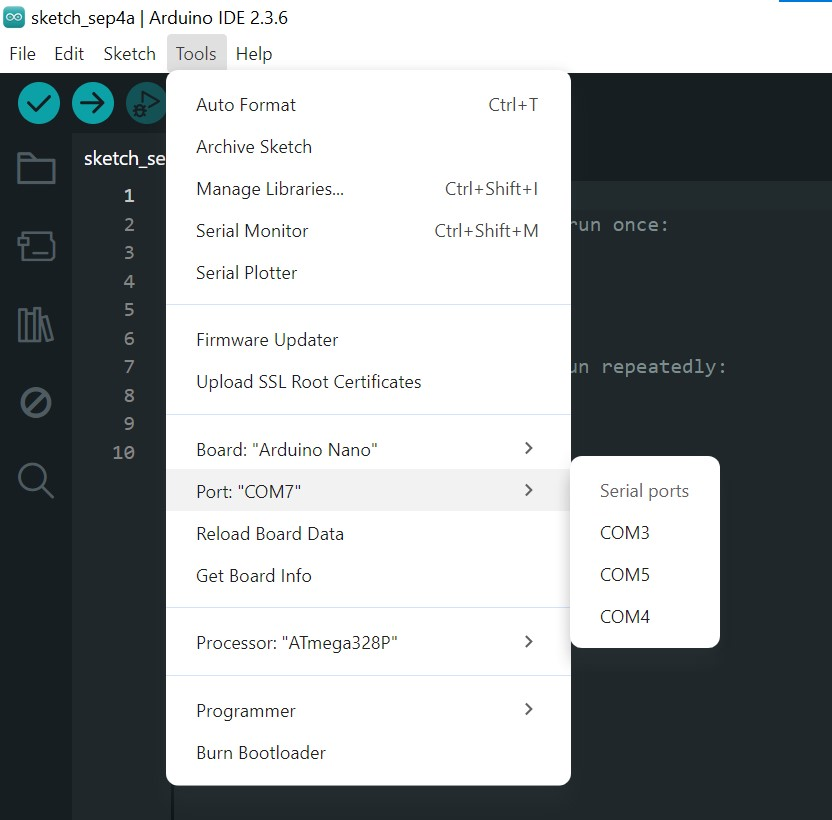
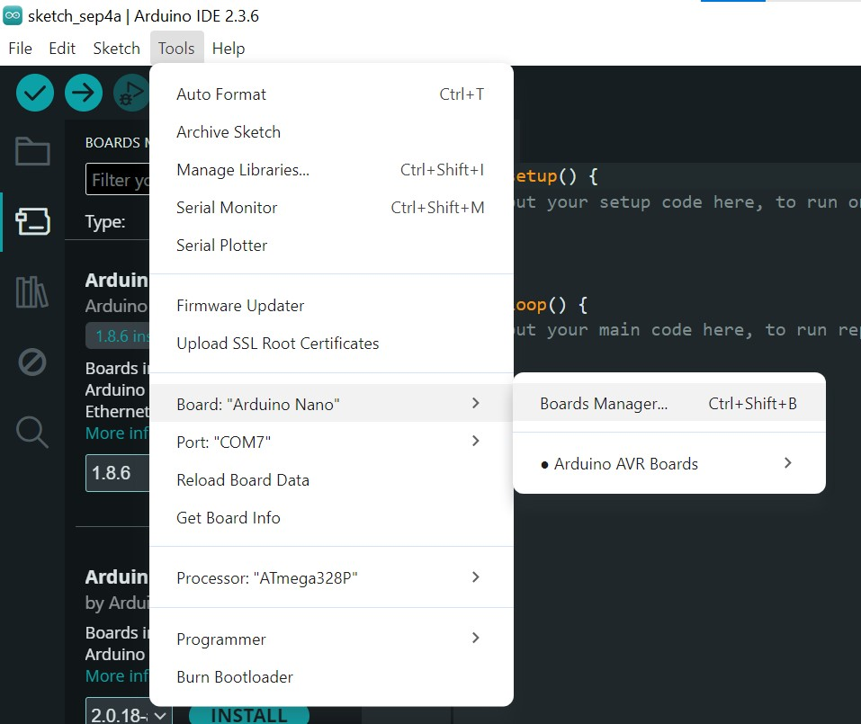
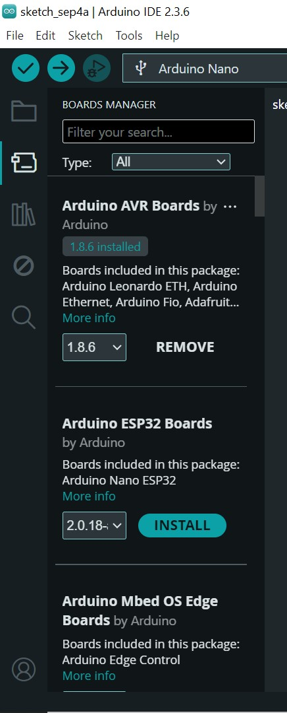
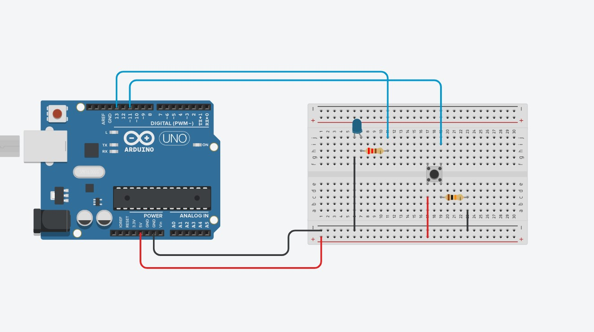
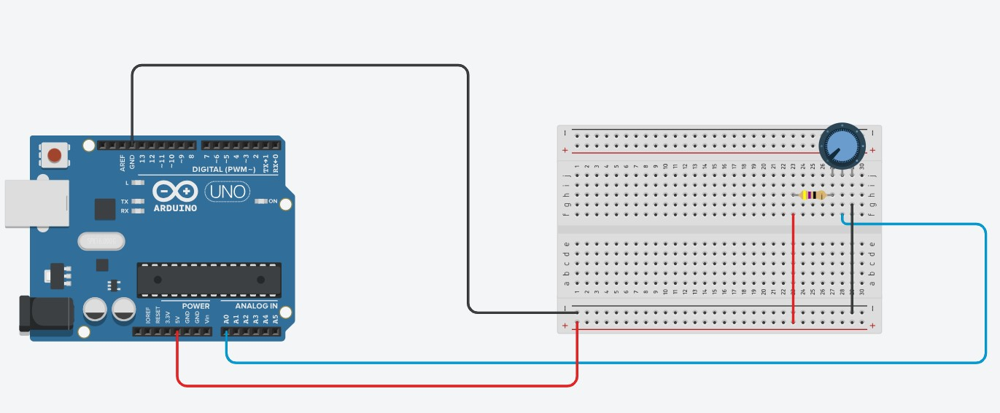

## O que é esse guia?

Um manual rápido para trabalho com placas Arduino, além de instalação e configurações do Arduino IDE.

---

## Instalação do Arduino IDE 

Arduino IDE (Ambiente de Desenvolvimento Integrado - IDE) é um software onde é possível desenvolver e 
compilar códigos em C/C++, e também enviar esse código para o microcontrolador,
onde o mesmo funcionará de forma independente, mesmo se desconectado do computador.
Para o download da IDE que permite a programação de placas Arduino acesse [aqui.](<https://www.arduino.cc/en/software/>) 
A instalação segue os moldes padrões de qualquer instalador convencional.

---

## Configurações

Após instalar com sucesso a IDE, será necessário conectar o microcontrolador ao computador por meio de uma porta USB. Você
precisará selecionar qual o modelo de arduino está sendo utilizado (ex: Arduino UNO, Arduino NANO), 
conforme apresentado na imagem que segue.




Em seguida, será necessário indicar à IDE qual porta está sendo utilizada pelo seu Arduino. Para isto basta 
ir novamente ao menu ferramentas, mas dessa vez selecionando a opção "Port". Você verá uma lista de portas disponíveis. Geralmente, a porta correta será identificada com o nome da
placa ao lado (ex: "COM3 (Arduino Uno)"). 

Se houver dúvidas, desconecte a placa, verifique quais portas 
sumiram da lista e conecte-a novamente para confirmar. Alternativamente, consulte a porta que está 
sendo utilizada pelo seu Arduino no Gerenciador de Tarefas do Windows.



---

## Instalação de Drivers

Embora a instalação do Arduino IDE em sistemas operacionais modernos inclua os drivers 
necessários para placas originais, placas "clones" ou similares podem exigir a instalação manual de um
driver específico, para que a porta de comunicação seja reconhecida. 

Para isso verifique o chip próximo à porta USB da sua placa. Procure por nomes como "CH340G" ou "FT232RL". 
Em seguida, baixe e instale o driver correspondente para o seu sistema operacional. As 
duas imagens a seguir ilustram este procedimento.


|                  Ferramenta Board Manager                  |          Instalação de drivers           |
|:----------------------------------------------------------:|:----------------------------------------:|
|  |  |

---

## Exemplos de Aplicação

Existem diversos tipos de placas Arduino no mercado, e cada uma 
apresenta diferenças em suas portas de entrada e saída, aqui temos alguns códigos com comandos
simples e genéricos que poderâo auxiliar no entendimento da placa.

### Geração de Sinais - Acendendo um led com botão.
```c
int led = 13; //constante led refere-se ao pino digital 8.
int botao = 11; //constante botao refere-se ao pino digital 2.

//Variável que conterá os estados do botão (0 LOW, 1 HIGH).
int estadoBotao = 0;

void setup() {
  pinMode(led,OUTPUT); //Definindo pino digital 8 como de saída.
  pinMode(botao,INPUT); //Definindo pino digital 2 como de entrada.
}

void loop() {
  estadoBotao = digitalRead(botao);

  if (estadoBotao == HIGH) {
    digitalWrite(led,HIGH); //Botão pressionado, acende o led.
  } else {
    digitalWrite(led,LOW); //Botão não pressionado, apaga o led.
  }
}
```

|                         Acionamento do Led                         |
|:------------------------------------------------------------------:|
|  |


### Aquisição de Sinais - Lendo o valor de um potenciômetro.
```c
// Declara uma constante inteira chamada "potenciometro" e a associa ao pino analógico A0.
// No Arduino, usar o número 0 em funções analógicas é um atalho para o pino A0.
const int potenciometro = 0;

// Cria uma variável chamada "valor" para armazenar o número lido do potenciômetro.
// Inicializa uma ela com o valor 0.
int valor = 0;


void setup() {
  // Inicia a comunicação serial com o computador a uma velocidade de 9600 bits por segundo.
  // Isso é essencial para que o Arduino possa enviar dados para o Monitor Serial.
  Serial.begin(9600);
}

void loop() {
  // Lê a tensão no pino analógico definido pela variável "potenciometro" (A0).
  // A função converte a tensão lida (de 0V a 5V) em um valor numérico entre 0 e 1023.
  // O resultado dessa leitura é armazenado na variável "valor".
  valor = analogRead(potenciometro);

  // Envia o conteúdo atual da variável "valor" para o Monitor Serial do computador.
  // O "ln" (line new) faz com que, após imprimir o valor, o cursor pule para a próxima linha.
  Serial.println(valor);

  // Pausa a execução do programa por 100 milissegundos (ou 0.1 segundos).
  // Isso evita que os dados sejam enviados rápido demais, facilitando a leitura no monitor.
  delay(100);
}
```

|                       Leitura do Potenciômetro                       |
|:--------------------------------------------------------------------:|
|  | 


---

## Ambientes de Simulação

No nosso laboratório de pesquisa, há várias unidades de Arduino disponíveis para uso em 
atividades de pesquisa. Entretanto, caso você se sinta inseguro, há diversas ferramentas que permitem
a simulação, antes de ir para a parte prática. Dentre os diversos ambientes de simulação o [TinkerCAD](https://www.tinkercad.com) se mostra
como uma importante ferramenta nesta áreia. 

Para acessar e utilizar basta acesar o link acima e após isso se cadastrar no site, há uma aba [Aprenda](https://www.tinkercad.com/learn/circuits?collectionId=O0K87SQL1W5N4P2) com diversos 
tutoriais nos mostrando como simular os circuitos mais básicos e as funcionalidades do site. 

---

