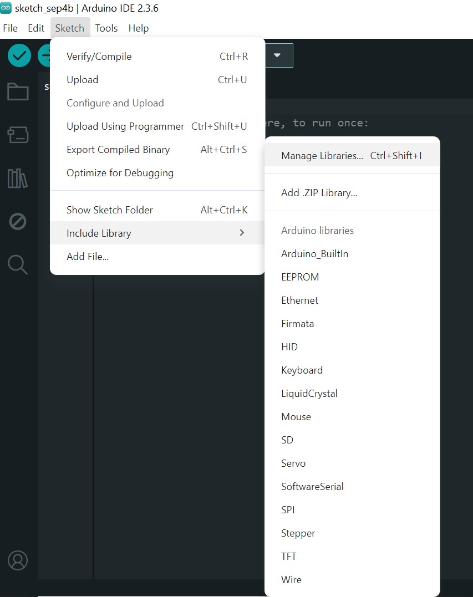

#O que é esse guia?

Manual rápido para trabalho com placas Arduino, além de instalação e configurações do Arduino IDE, 
e plataformas de simulação como TinkerCAD.

#Arduino IDE

**Instalação**

Arduino IDE é um software onde é possível desenvolver e 
compilar códigos em linguagem C/C++, e também enviarmos esse código para a
placa, onde ela funcionará de forma independente, desconectada do computador.
Para o download do software basta acessar <https://www.arduino.cc/en/software/>

##Configurações

Após instalar com sucesso o ‘software’ será necessário conectar o microcontrolador ao computador, você
precisará selecionar qual o modelo de arduino está sendo utilizado (ex: Arduino UNO, Arduino NANO)


Depois disso será necessário indicar a IDE qual porta está sendo utilizada pela sua placa, par isso basta 
ir novamente ao menu ferramentas, porém dessa vez selecione a opção porta. 
Você verá uma lista de portas disponíveis. Geralmente, a porta correta será identificada com o nome da
placa ao lado (ex: "COM3 (Arduino Uno)"). Se houver dúvidas, desconecte a placa, verifique quais portas 
sumiram da lista e conecte-a novamente para confirmar.


Embora a instalação do Arduino IDE em sistemas operacionais modernos inclua geralmente os drivers 
necessários para placas originais, placas "clones" ou similares podem exigir a instalação manual de um
driver específico, para que a porta de comunicação seja reconhecida. Para isso
verifique o chip próximo à porta USB da sua placa. Procure por nomes como "CH340G" ou "FT232RL". 
Em seguida, baixe e instale o driver correspondente para o seu sistema operacional.


Para o desenvolvimento de quaisquer códigos dentro do arduino bibliotecas serão de suma importância, 
para importá-las e conseguir trabalhar de maneira mais fácil é necessário:



#Desenvolvimento do projeto 
Existem diversos tipos de placas Arduino no mercado, e cada uma 
apresenta diferenças em suas portas de entrada e saída, aqui temos alguns códigos com comandos
simples e genéricos que poderâo auxiliar no entendimento da placa.

**Acendendo um led com botão.**
```c
const int pinoBotao = 2; 
const int pinoLed = 13;

int estadoBotao = 0; 
void setup() {
  pinMode(pinoLed, OUTPUT);
  pinMode(pinoBotao, INPUT);
}

void loop() {
  estadoBotao = digitalRead(pinoBotao);

  if (estadoBotao == HIGH) {
    digitalWrite(pinoLed, HIGH);
  } else {
    digitalWrite(pinoLed, LOW);
  }
}
```
**Lendo o valor de um potênciometro.**
```c
const int pinoPotenciometro = A0;
int valorLido = 0;       

void setup() {
  Serial.begin(9600);
}

void loop() {
  valorLido = analogRead(pinoPotenciometro);

  Serial.print("Valor lido do potenciômetro: ");
  Serial.println(valorLido);

  delay(500);
}
```
Para definir quais entradas tem o arduino o qual você está trabalhando abra o 
datasheet específico do mesmo.

#Simulação

Ao trabalharmos com circuitos elétricos/eletrônicos uma etapa crucial é a simulação, já que com ela é possível
ter uma estimativa dos valores de saída desejados e por consequência conseguiremos adaptar os equipamentos
para que eles funcionem sem nenhum risco de acidente.


Dentre os diversos ambientes de simulação este guia abordará o básico sobre o [TinkerCAD](https://www.tinkercad.com).
Para acessar e utilizar basta acesar o link acima e após isso se cadastrar no site, há uma aba [Aprenda](https://www.tinkercad.com/learn/circuits?collectionId=O0K87SQL1W5N4P2) com diversos 
tutoriais nos mostrando como simular os circuitos mais básicos e as funcionalidades do site. 


#


